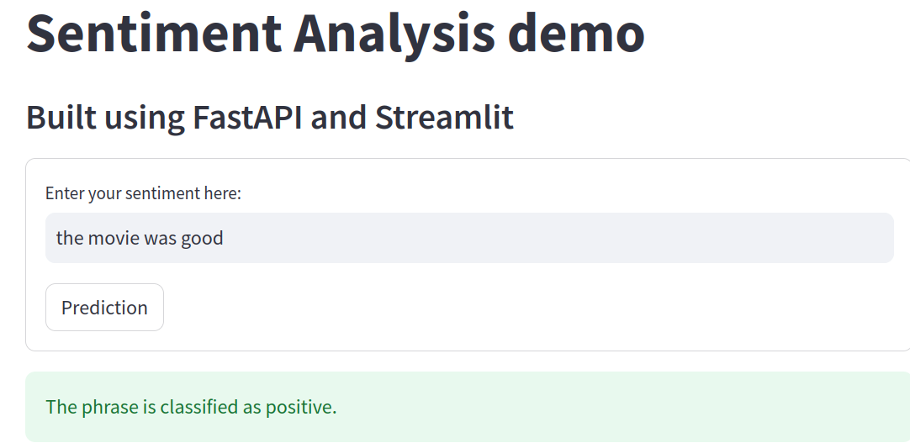
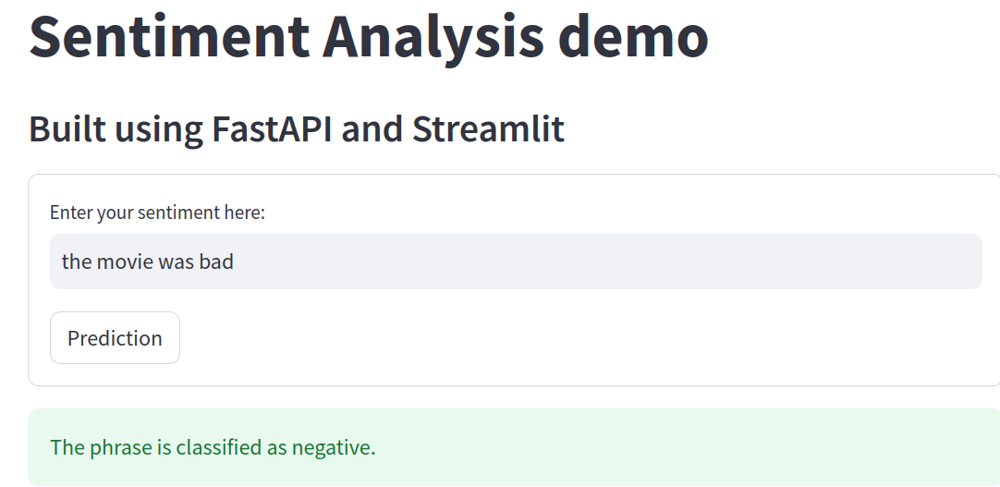
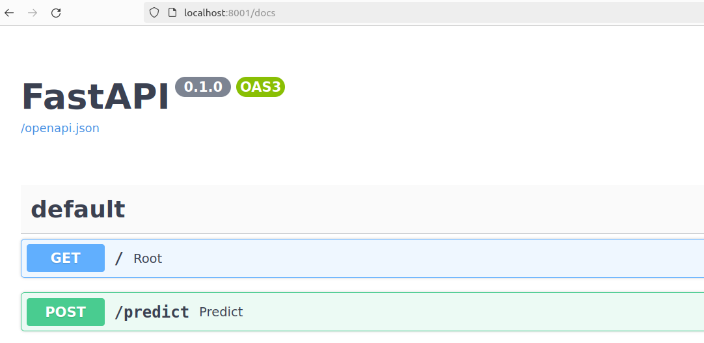

## Reproducing the FastAPI-ONNX Inference For Sentiment Analysis

### How to run

#### Prerequisites:
* Docker
* Binary file for the task in onnx format. Download it from this [link](https://github.com/kundanapillari/models/tree/master/text/machine_comprehension/roberta/model) and put in the webapp folder 

1. Create a docker containers for `frontend` and `backend` services using command `docker-compose up -d`
2. Go to [http://localhost:8502](http://localhost:8502) for Streamlit UI (fronted)
3. Go to [http://localhost:8001/docs](http://localhost:8001/docs) for Swagger UI (backend)

